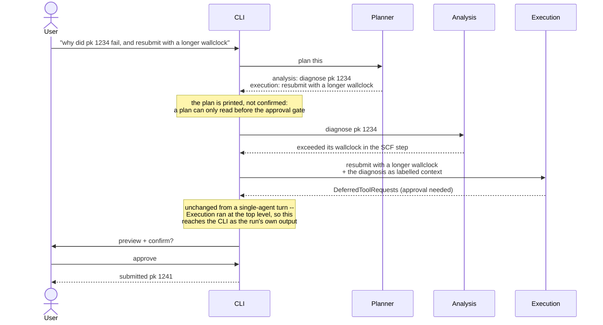

# ADR-09: Agent orchestration — a planner over two specialists

## Context

ADR-04 built one agent first and deferred the rest, on the principle that multi-agent routing before a single working agent is complexity without a concretion to validate it.
Two agents now exist as sibling subpackages: Analysis (read-only provenance exploration) and Execution (workflow submission, the "Workflow Agent" of ADR-04's table).

Three things about the current state matter for this decision.

**Routing already exists — a human does it.**
The CLI selects the agent with `--agent` / `-a`, and `/agent` switches mid-session.
Every request is already routed; the open question is only whether a model can make that choice instead of the user.

**No agent has ever called another agent.**
`tools/execution/analysis_queries.py` exposed `query_analysis_agent`, whose docstring said the Execution agent used it "to ask Analysis Agent about past successful runs".
It did not: it runs `QueryBuilder` queries directly, in this process.
(It has since been renamed to `query_run_context`, as this ADR decides below.)
ADR-04 left "A2A vs. plain function calls" to be "decided empirically", and there has been no empirical input — only an artifact whose name implies the question was already settled.

**The constraint that motivated splitting has weakened.**
ADR-04 and the timeline assumed local models, where a narrow tool surface and a short prompt were necessary.
Both maintainers have since tested local models and found them unreliable for this workload — hallucinated APIs, answers well below cloud quality — and cloud models are now sanctioned.
That removes the context-window argument for splitting agents.

What survives is the argument that actually matters: the **read/write risk boundary**.
Analysis is read-only; Execution holds the approval-gated writes.
That split is worth keeping, but note it is enforced by `requires_approval` on the tool, not by the agent boundary — ADR-04 says so itself.
An orchestrator adds nothing to that safety property.

So the orchestrator has to justify itself on capability, not on safety and not on context budget.

## Decision

Build a **planner**: one component that decides which specialist does what, and in what order.

Routing and multi-step coordination were scheduled as two increments, and shipped as one component, because routing a request to a single specialist is the degenerate case of planning — a plan of length one.
A separate router would have had to be replaced rather than extended, and a simple request would have paid for two model calls instead of one.

An earlier draft of this ADR argued the reverse — that routing merely automates a CLI flag, and only multi-step coordination justified the layer.
The scenarios exercise ([`docs/gsoc/agent-scenarios.md`](/docs/gsoc/agent-scenarios.md)) does not support that.
Of twelve plausible requests, eight are served by a single specialist and two are served equally well by either, so cross-agent coordination is not load-bearing for the common case.
Routing, by contrast, is needed by all twelve: today every request requires the user to know the agent taxonomy and pass `-a`, and there is no request for which asking them to choose improves the answer.

Routing also turns out to be lower-risk than assumed.
The two most ambiguous request classes — status checks and documentation questions — are ones *both* agents can serve, so mis-routing there costs nothing.

Multi-step planning is worth having on narrower grounds than the first draft claimed: one scenario needs it (diagnose a failure, then resubmit with the fix), and that scenario is plausibly the most valuable thing the system could do.
A second candidate — using historical parameters to inform a new submission — turned out to be already served inside Execution by `query_run_context`, which is evidence that some cross-agent needs are better met by a plain tool than by delegation.

The planner never calls a specialist; the CLI does, one step at a time.
That is what keeps the approval path intact.

Concretely:

- The planner is a `pydantic_ai.Agent` with **no tools at all**, which is a departure from ADR-04's sketch of an orchestrator whose tools are the specialist calls.
  Wrapping the specialists in tools would break the human-in-the-loop guarantee: HITL works because a specialist's run returns `DeferredToolRequests` as its *output* and the CLI intercepts it, then resumes that same agent with the approved results.
  A specialist running inside another agent's tool call would hand that request back as a tool *result* the CLI never sees, and the approval loop would resume the wrong agent.
  So the planner only names steps, and the CLI runs each specialist at the top level exactly as it does for a single-agent turn — the approval path is untouched by construction rather than by care.
- A step's answer is handed to the next step as **explicit text**, labelled with which specialist produced it, not as replayed message history: the specialists hold different tools, so one agent's history references tools the other does not have.
- **Three steps at most.** Beyond that a plan is speculation about what earlier steps will find, and the planner has seen none of them.
- A plan that cannot be parsed is rejected **whole** and falls back to a single read-only step. Running the usable half of a rejected plan would be a different plan, whose remaining steps act on a premise nobody established.
- It becomes the default entry point for `chat` and `ask`; `--agent` remains as an override for debugging and for users who know which specialist they want.
- **Specialists do not call each other.**
  All agent-to-agent traffic goes through the coordinator, so there is one routing path rather than two places for the same bug to live.
  This settles ADR-04's open A2A question in favour of plain in-process function calls: a separate agent-to-agent protocol buys nothing while both specialists run in the same interpreter against the same profile.
- `query_analysis_agent` is renamed `query_run_context` — a query about what this profile already contains — so the naming stops implying a delegation that does not happen.
- Cap at two specialists.
  Diagnosis stays a tool on Analysis (`get_process_report`) rather than becoming a third agent; the timeline already pairs them as "explore/diagnostic".

### What stays deterministic code, and what the model decides

The distinction is the point, so it is written down rather than left to a prompt.

| Concern                                        | Decided by                      | Why                                                           |
| ---------------------------------------------- | ------------------------------- | ------------------------------------------------------------- |
| Which specialist handles a request             | Model                           | A natural-language intent problem; there is no reliable rule. |
| The plan for a multi-step job                  | Model                           | Same.                                                         |
| Whether a write needs human approval           | Code (`requires_approval`)      | A prompt can be talked out of it; a tool boundary cannot.     |
| Input validation and node-reference resolution | Code (ADR-07, `spec_execution`) | Deterministic and testable; a model adds only variance.       |

The coordinator is a language layer over a system whose safety-critical behaviour remains structural.

## Consequences

- One extra model round-trip per request: added latency and tokens on every query, including ones a single specialist could have served alone.
- Mis-routing becomes a real failure mode.
  This is what the opt-in eval tier (ADR-06, `tests/evals/`) measures, so it is observable rather than anecdotal.
- **Approval propagation through a nested agent is the riskiest part of this change.**
  Today HITL works because Execution returns `DeferredToolRequests` as its output and the CLI intercepts it.
  With Execution running inside a coordinator tool call, that request must reach the CLI intact.
  This is the same seam where approved-but-never-executed tools have already shipped once (PRs #33/#36), now with a layer above the gate on the path that submits real calculations.
  It is built and tested before any coordinator routing logic, deterministically with `FunctionModel`.
- Conversation context must be passed to specialists explicitly; a sub-agent does not see the parent's history for free.
- ADR-04's future-architecture table is superseded: three planned specialists (Diagnostic, Config, Workflow) become two, with diagnosis folded into Analysis.

## Alternatives considered

- **A router that picks one agent per turn, and nothing more.**
  Not rejected — adopted as the first increment, on the scenarios evidence that routing is what pays off across every request.
  It is the degenerate case of the coordinator (a one-step plan), so the second increment extends it rather than replacing it.
  Stopping permanently at a router is a legitimate outcome if the multi-step case does not prove out in use.
- **No orchestrator; keep `--agent`.**
  Genuinely defensible, and cheaper.
  Rejected because it leaves every cross-agent job (diagnose then resubmit) impossible, and because requiring users to know the agent taxonomy is a poor interface for a natural-language tool.
- **Merge both agents into one.**
  Newly defensible now that cloud models are sanctioned and the context argument has weakened.
  Rejected to keep the read/write boundary legible: one agent holding both read tools and approval-gated writes makes the risk surface harder to reason about, and the split costs little.
- **LangGraph or a dedicated orchestration framework.**
  Already rejected in ADR-04; the same bar applies to our own orchestration layer, which is why this ADR keeps it to one agent with two tools.
- **A formal agent-to-agent (A2A) protocol.**
  Rejected for now: both specialists run in one process against one profile, so serialisation and transport buy nothing.
  Revisit if a specialist ever runs out-of-process.

## Validation

This decision was made falsifiable and then tested, before any code was written.

[`docs/gsoc/agent-scenarios.md`](/docs/gsoc/agent-scenarios.md) lists twelve plausible requests and checks each against the tools the two agents hold.
It partly falsified the first draft of this ADR — the multi-step justification is narrower than claimed, and one motivating example was already solved — which is why the Decision above leads with routing.
The structural decisions were unaffected: one routing path, specialists that do not call each other, approval enforced by `requires_approval` and propagated through the coordinator, two specialists rather than three.

Two caveats bound how much weight this evidence carries.
The scenarios were written by inference from the tool surface and the domain, not gathered from the MSD group or from usage logs, so they should be reviewed by someone with the scientific context before being treated as requirements.
And the exercise surfaced a capability gap that partly undercuts the coordinator's strongest scenario: nothing can read a calculation's own output files, so a diagnosis that feeds a resubmission cannot yet see why the calculation actually failed.
That gap is worth closing first.
