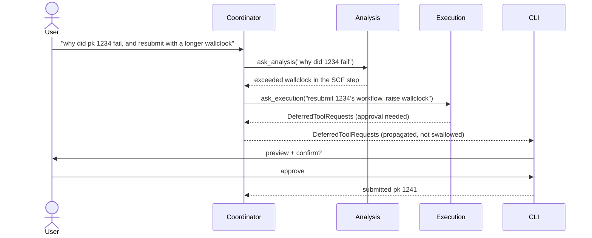

# ADR-09: Agent orchestration — a coordinator over two specialists

## Context

ADR-04 built one agent first and deferred the rest, on the principle that multi-agent routing before a single working agent is complexity without a concretion to validate it.
Two agents now exist as sibling subpackages: Analysis (read-only provenance exploration) and Execution (workflow submission, the "Workflow Agent" of ADR-04's table).

Three things about the current state matter for this decision.

**Routing already exists — a human does it.**
The CLI selects the agent with `--agent` / `-a`, and `/agent` switches mid-session.
Every request is already routed; the open question is only whether a model can make that choice instead of the user.

**No agent has ever called another agent.**
`tools/execution/analysis_queries.py` is named `query_analysis_agent` and its docstring says the Execution agent uses it "to ask Analysis Agent about past successful runs".
It does not: it runs `QueryBuilder` queries directly.
ADR-04 left "A2A vs. plain function calls" to be "decided empirically", and there has been no empirical input — only an artifact whose name implies the question was already settled.

**The constraint that motivated splitting has weakened.**
ADR-04 and the timeline assumed local models, where a narrow tool surface and a short prompt were necessary.
Both maintainers have since tested local models and found them unreliable for this workload — hallucinated APIs, answers well below cloud quality — and cloud models are now sanctioned.
That removes the context-window argument for splitting agents.

What survives is the argument that actually matters: the **read/write risk boundary**.
Analysis is read-only; Execution holds the approval-gated writes.
That split is worth keeping, but note it is enforced by `requires_approval` on the tool, not by the agent boundary — ADR-04 says so itself.
An orchestrator adds nothing to that safety property.

So the orchestrator has to justify itself on capability, not on safety and not on context budget.

## Decision

Build a **coordinator**, not a router.

A router picks one specialist per turn.
That replaces a CLI flag: it costs an extra model round-trip per request and introduces mis-routing as a new failure mode, in exchange for convenience the flag already provides.

A coordinator runs a multi-step job **across** specialists, carrying state between them.
That is capability no flag can provide, and it is what the project's "multi-agent" claim cashes out to.

Concretely:

- The Orchestrator is a `pydantic_ai.Agent` whose only tools are the specialist calls (`ask_analysis`, `ask_execution`), exactly as ADR-04 specified.
- It becomes the default entry point for `chat` and `ask`; `--agent` remains as an override for debugging and for users who know which specialist they want.
- **Specialists do not call each other.**
  All agent-to-agent traffic goes through the coordinator, so there is one routing path rather than two places for the same bug to live.
  This settles ADR-04's open A2A question in favour of plain in-process function calls: a separate agent-to-agent protocol buys nothing while both specialists run in the same interpreter against the same profile.
- `query_analysis_agent` is renamed to what it is — a historical-statistics tool over the database — so the naming stops implying a delegation that does not happen.
- Cap at two specialists.
  Diagnosis stays a tool on Analysis (`get_process_report`) rather than becoming a third agent; the timeline already pairs them as "explore/diagnostic".

### What stays deterministic code, and what the model decides

The distinction is the point, so it is written down rather than left to a prompt.

| Concern                                        | Decided by                      | Why                                                           |
| ---------------------------------------------- | ------------------------------- | ------------------------------------------------------------- |
| Which specialist handles a request             | Model                           | A natural-language intent problem; there is no reliable rule. |
| The plan for a multi-step job                  | Model                           | Same.                                                         |
| Whether a write needs human approval           | Code (`requires_approval`)      | A prompt can be talked out of it; a tool boundary cannot.     |
| Input validation and node-reference resolution | Code (ADR-07, `spec_execution`) | Deterministic and testable; a model adds only variance.       |

The coordinator is a language layer over a system whose safety-critical behaviour remains structural.

## Consequences

- One extra model round-trip per request: added latency and tokens on every query, including ones a single specialist could have served alone.
- Mis-routing becomes a real failure mode.
  This is what the opt-in eval tier (ADR-06, `tests/evals/`) measures, so it is observable rather than anecdotal.
- **Approval propagation through a nested agent is the riskiest part of this change.**
  Today HITL works because Execution returns `DeferredToolRequests` as its output and the CLI intercepts it.
  With Execution running inside a coordinator tool call, that request must reach the CLI intact.
  This is the same seam where approved-but-never-executed tools have already shipped once (PRs #33/#36), now with a layer above the gate on the path that submits real calculations.
  It is built and tested before any coordinator routing logic, deterministically with `FunctionModel`.
- Conversation context must be passed to specialists explicitly; a sub-agent does not see the parent's history for free.
- ADR-04's future-architecture table is superseded: three planned specialists (Diagnostic, Config, Workflow) become two, with diagnosis folded into Analysis.

## Alternatives considered

- **A router that picks one agent per turn.**
  Rejected as the primary goal: it automates a flag while adding a round-trip and a failure mode.
  It is, however, the degenerate case of the coordinator — a one-step plan — so nothing here forecloses it.
- **No orchestrator; keep `--agent`.**
  Genuinely defensible, and cheaper.
  Rejected because it leaves every cross-agent job (diagnose then resubmit) impossible, and because requiring users to know the agent taxonomy is a poor interface for a natural-language tool.
- **Merge both agents into one.**
  Newly defensible now that cloud models are sanctioned and the context argument has weakened.
  Rejected to keep the read/write boundary legible: one agent holding both read tools and approval-gated writes makes the risk surface harder to reason about, and the split costs little.
- **LangGraph or a dedicated orchestration framework.**
  Already rejected in ADR-04; the same bar applies to our own orchestration layer, which is why this ADR keeps it to one agent with two tools.
- **A formal agent-to-agent (A2A) protocol.**
  Rejected for now: both specialists run in one process against one profile, so serialisation and transport buy nothing.
  Revisit if a specialist ever runs out-of-process.

## Validation

This decision is falsifiable, and should be tested before the code is written.

The first step is a scenarios document: 8–10 real user requests the system should serve end to end, each checked against what the current agents can do.
If most of them turn out to be answerable by a single specialist, the coordinator is over-engineering and this ADR should be revised down to a router — or to nothing.
That exercise is the empirical input ADR-04 asked for and never received.
