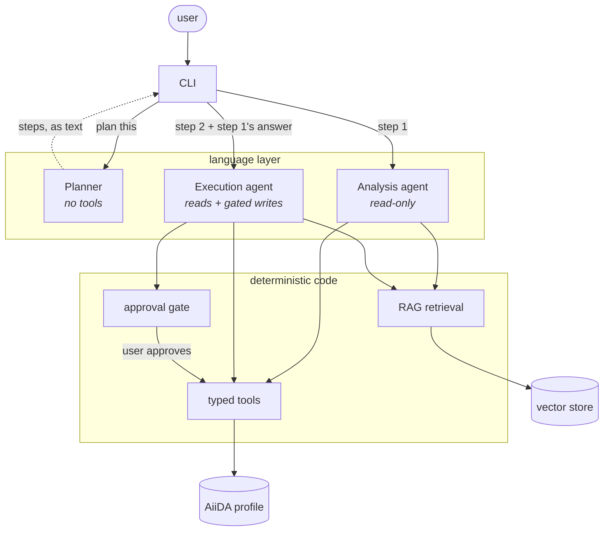

# Architecture

`aiida-agents` turns a natural-language request into calls against a real AiiDA profile.
This page explains how a request travels through the system and why the pieces are arranged as they are.
The [Architecture Decision Records](/docs/adr/README.md) hold the reasoning behind each individual decision; this page is the map.

## The shape of it

A request is handled by a **planner** that decides which specialists do what, and by **specialists** that hold tools.
Nothing else is an agent: the tools, the retrieval layer and the approval gate are ordinary code.

Read the arrows carefully: **the planner never calls a specialist**, and **specialists never call each other**.
The CLI runs each specialist itself. That is not incidental — see [Why the planner has no tools](#why-no-tools).

## The request lifecycle

1. **Plan.** The CLI asks the planner what to do. The planner replies with one or more `specialist: task` lines and has no tools, so this step cannot touch the database. Most requests come back as a single step.
1. **Run each step.** For each step the CLI builds (or reuses) that specialist and runs it, exactly as it would for a single-agent turn.
1. **Tools.** The specialist calls typed Python functions against the live profile. Read tools that fail return a recoverable retry to the model rather than aborting the run.
1. **Retrieval.** For anything conceptual, the specialist searches the indexed AiiDA documentation and any installed plugin's contributed corpus.
1. **Approval.** If a step proposes a write, the run pauses and returns the proposed call. The CLI shows it and asks. Nothing is written without a yes.
1. **Hand forward.** A step's answer is passed to the next step as a typed handoff: its findings, plus the node references its tools returned.
1. **Check.** Before the answer is shown, every physical quantity in it is checked against what the tools actually returned; anything unsupported is flagged.

## The two boundaries that matter

Almost every design decision in this project falls out of one of these.

### Read versus write

The Analysis agent holds no tool that can change anything. The Execution agent holds two that can, and both are registered with `requires_approval=True`.

The guarantee lives on **the tool**, not on the agent — a plugin-contributed write tool is gated the same way whichever agent holds it, and no prompt can talk the system out of it.
That is why the split survives even though the original reason for it (small models needing narrow tool surfaces) has weakened.

See [ADR-08](/docs/adr/08-human-in-the-loop-before-writes.md).

### Model decides versus code decides

| Concern | Decided by | Why |
| --- | --- | --- |
| Which specialist handles a request, and in what order | Model | A natural-language intent problem; no reliable rule exists. |
| Which tool to call, with what arguments | Model | Same. |
| Whether a write needs approval | Code | A prompt can be argued out of it; a tool boundary cannot. |
| Input validation and node-reference resolution | Code | Deterministic and testable; a model adds only variance. |
| Whether an answer's numbers are supported | Code | Checked after the fact, so it does not depend on the model having complied. |

The language layer is thin on purpose. Everything a wrong answer could damage is decided by code.

## The components

**Planner** (`agents/planner/`) — no tools, one cheap call. Emits `specialist: task` lines, parsed strictly. A plan that cannot be parsed is rejected whole and falls back to a single read-only step. Capped at three steps. See [ADR-09](/docs/adr/09-agent-orchestration.md).

**Analysis agent** (`agents/analysis/`) — read-only exploration: querying nodes, following provenance, reading process reports and the files a calculation brought back, diagnosing a failure against the workflow's own exit codes and restart handlers, summarising past runs, searching the docs.

**Execution agent** (`agents/execution/`) — discovering installed workflows, inspecting their input schemas, building inputs from a workflow's own protocol builder (or, for a process that has none, drafting them from its declared ports), checking the cutoffs against the pseudopotentials, importing a structure, submitting, waiting for a submission so the next one can run on its result, and rebuilding a past run's inputs to re-run it. Its three write tools are approval-gated — including the batch, which is one approval covering the whole set.

**Tools** (`tools/`) — plain typed functions, grouped to mirror the agents. `tools/analysis/` and `tools/execution/` are owned by one agent each; anything both use lives at the top level. A tool's name, signature and docstring *are* its interface to the model.

**RAG** (`rag/`) — the AiiDA documentation, and any plugin's own docs, chunked and embedded into a vector store. A collection is keyed by docs version, corpus format and embedding model, so a query can never hit an index built with a different embedder. See [ADR-05](/docs/adr/05-rag-over-aiida-docs.md).

**MCP server** (`mcp/`) — exposes the read-only tools over the Model Context Protocol, so any MCP client reaches the same functions the agents do. The write tools are deliberately not registered: they go only through the approval-gated agents. See [ADR-02](/docs/adr/02-mcp-tools-wrap-aiida-restapi.md).

**Grounding check** (`grounding.py`) — extracts every quantity carrying a unit, written as a percentage, or bound to a named simulation parameter from an answer, and reports any that appear in no tool output. A percentage is grounded by its fraction, so a `success_rate` of 0.67 supports "67%".

**CLI** (`cli/`) — `chat` for a conversation, `ask` for one shot, plus `doctor`, `rag` and `config`. It owns the plan loop and the approval prompt.

(why-no-tools)=

## Why the planner has no tools

The obvious design is an orchestrator whose *tools* are the specialists. It was rejected, and the reason is worth stating because it constrains anything built on top.

Approval works like this: when a specialist proposes a write, its run **returns** a deferred request as its output. The CLI sees that, shows the user, and resumes *that same agent* with the approved result.

If a specialist ran inside another agent's tool call, its deferred request would come back as a tool *result* the outer agent would consume — the CLI would never see it, and the approval loop would resume the wrong agent.
Wrapping the specialists would break the guarantee that nothing is written without confirmation.

So the planner only names steps, and the CLI runs them. The approval path is untouched by construction rather than by care.

## What is deliberately absent

Stating these saves the next reader from assuming they were overlooked.

**No direct agent-to-agent channel.** Collaboration happens through the plan and a typed handoff message, mediated by the CLI, for the reason above. The message carries the producing step's findings *and* the node references its tools returned, so the next step works from identifiers rather than re-reading a pk out of a sentence — see [`agents/handoff.py`](/src/aiida_agents/agents/handoff.py). What is absent is a *transport*: a channel between processes would buy nothing while both specialists run in one interpreter against one profile, and routing a specialist's output anywhere but the CLI would break the approval gate.

**No physics validation that blocks.** Cutoffs *are* checked against what the spec's pseudopotential family was converged for, but the finding is shown at the approval prompt rather than refusing the submission: a low cutoff is under-converged for production and perfectly reasonable for a smoke test, so a gate would be wrong about as often as it was right. Nothing in the system refuses a physically unusual submission on its own authority. See [ADR-07](/docs/adr/07-validator.md).

**No recommended k-point spacing.** No installed package publishes one per structure, so `kpoints_distance` is left unchecked rather than measured against a number this project invented.

**No third specialist.** Diagnosis is a tool on the Analysis agent rather than a Diagnostic agent of its own; two specialists have so far been enough.

**No workflow construction.** Multi-step calculations are composed by running existing workflows in sequence and feeding one's output to the next. Nothing emits a new `WorkChain` class, and the provenance shape differs accordingly — the steps are linked by the data between them, not by a parent process. Where a plugin already ships a work chain for the whole sequence, that remains the better answer.

## Where the depth is

| Topic | ADR |
| --- | --- |
| Package layout | [01](/docs/adr/01-package-scaffolding.md) |
| MCP tool layer | [02](/docs/adr/02-mcp-tools-wrap-aiida-restapi.md) |
| Provider-agnostic model layer | [03](/docs/adr/03-llm-library.md) |
| Agents subpackage, single agent first | [04](/docs/adr/04-multi-agent-architecture.md) |
| RAG over the docs | [05](/docs/adr/05-rag-over-aiida-docs.md) |
| Evaluation harness | [06](/docs/adr/06-eval-harness.md) |
| Validator | [07](/docs/adr/07-validator.md) |
| Human-in-the-loop before writes | [08](/docs/adr/08-human-in-the-loop-before-writes.md) |
| Planner over two specialists | [09](/docs/adr/09-agent-orchestration.md) |

To add something of your own, see [Extending](/docs/extending.md).
