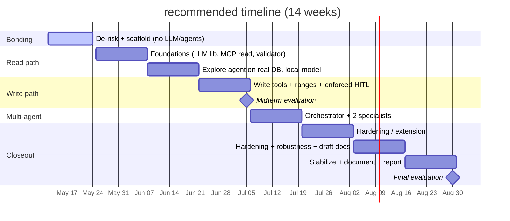

# GSoC 2026 — Project Timeline

GSoC project planning, kept here under `docs/gsoc/` (separate from the architecture ADRs in [`docs/adr/`](/docs/adr/)).
Length: **14 weeks** (~25 h/week at 350h), confirmed with the contributor — not set in stone; we'll revisit at the midterm if the pace warrants.

## Context

GSoC 2026 official dates (confirmed from Google):

| Date             | Event                       |
| ---------------- | --------------------------- |
| Apr 30           | Accepted projects announced |
| May 1 – 24       | Community bonding           |
| **May 25**       | **Coding begins**           |
| ≈ end of week 6  | Midterm evaluation          |
| ≈ end of week 14 | Final evaluation            |

This is a 350h "large" project; GSoC defaults to 12 weeks but allows 8–22 in 2-week steps.
We run **14 weeks** at ~25 h/week — the realistic pace given the AiiDA learning curve and no prior domain exposure.
This isn't locked: GSoC allows a one-time extension or an earlier finish, so we adjust at the midterm if needed.

The timeline stays consistent with the architecture decisions in [`docs/adr/`](/docs/adr/): scaffolding before any feature code; an existing provider-agnostic LLM library (local + cloud); MCP tools wrapping `aiida-restapi`; a deterministic Validator preceding any write path; plugin extensibility built only after a working concretion; a read-only exploration agent first, writes and HITL later.

## Original timeline (from the proposal, reproduced verbatim)

- **Pre-GSoC (Apr–May)**
  - Read AiiDA codebase.
  - Set up dev environment.
  - Map which AiiDA API calls match the proposed MCP tools.
  - **Deliverable:** Codebase notes shared with mentors
- **Community Bonding (May 8–Jun 1)**
  - Understand AiiDA workflow hierarchy.
  - Discuss and finalize MCP tool list with mentors.
  - Set up MCP server skeleton.
  - **Deliverable:** Agreed MCP tool specification
- **Phase 1 (Jun 2–Jun 29)**
  - Build MCP server with 5 core tools.
  - Build Orchestrator and Workflow agents.
  - First end-to-end test: natural language to AiiDA workflow submission.
  - **Deliverable:** Working Orchestrator + Workflow agent. First merged commit.
- **Phase 2 (Jun 30–Jul 27)**
  - Add Config and Diagnostic agents.
  - Build Validator layer.
  - Set up RAG with doc indexing.
  - Integration tests.
  - **Deliverable:** Validator live. RAG working. Phase 2 evaluation commit.
- **Phase 3 (Jul 28–Aug 24)**
  - Add Analysis agent.
  - Refine agent communication.
  - Build CLI user interface.
  - Write architecture documentation.
  - **Deliverable:** Full system end-to-end. Docs complete.
- **Final (Aug 25–Sep 8)**
  - Code cleanup, final tests, mentor review.
  - Blog post.
  - Final submission.
  - **Deliverable:** Final PR merged.

### Assessment of the original timeline

The _shape_ is sound: phased, deliverable-oriented, includes docs and a blog post, reserves a final stabilization phase.
Its phases already sum to ~14 weeks of coding — the length we adopt.
The concrete problems the recommended timeline fixes:

1. **Dates are wrong.** "Community Bonding May 8–Jun 1" and "Phase 1 Jun 2" do not match GSoC 2026 (bonding ends May 24, coding begins **May 25**).
   Likely carried over from a previous year's calendar.
1. **It front-loads the dangerous path.** Phase 1's deliverable is "natural language → AiiDA workflow _submission_", but the Validator is not built until Phase 2.
   Unguarded writes before a validator or HITL exist is exactly the ordering we reject (validator and HITL must precede any write) — a wrong submission can waste thousands of core-hours.
1. **It builds multi-agent first.** Phase 1 builds an Orchestrator + Workflow agent.
   This contradicts the contributor's _own_ stated philosophy ("complexity should be earned, not assumed from the start") and our recommended sequencing (single working concretion first; multi-agent is back-third).
1. **No engineering scaffolding milestone.** Tests appear only as "Integration tests" in Phase 2 and "final tests" at the end.
   Scaffolding (tests, CI, lint) is best set up before feature code rather than as an afterthought.
1. **4-week phases at 25–30 h/week with zero AiiDA background** under-estimate the ramp; Phase 1's scope (MCP server + two agents + end-to-end) in 4 weeks is unrealistic for a domain newcomer.
1. **Invents a "Pre-GSoC" phase with its own deliverable.** GSoC has no pre-coding deliverable period.
   What the proposal splits into "Pre-GSoC" + "Community Bonding" is a _single_ phase: **community bonding (May 1–24 — the period we are in now)**.
   There is no separate Pre-GSoC deliverable; its tasks (read the AiiDA codebase, set up the dev environment, map AiiDA API calls to the proposed MCP tools) are community-bonding tasks and are folded into the bonding phase below.

RAG in Phase 2 and the final stabilization/blog phase are reasonable and are kept.

## Recommended timeline

**14-week plan.** Dates assume coding starts 2026-05-25.

- **Community bonding** — now → May 24 _(we are here; this single phase absorbs the proposal's "Pre-GSoC" + "Community Bonding" — there is no separate Pre-GSoC deliverable)_
  - De-risk the AiiDA unknown.
    No LLM, no agents.
    Concrete tasks: set up the dev environment; read the AiiDA codebase and `aiida-restapi`; install AiiDA, run a WorkChain, import the real `.aiida` archive; map AiiDA API calls to the proposed MCP tools; repo scaffolded (done); one read-only MCP tool (e.g. `get_process_status(pk)`) returning real data from the imported profile, invoked by hand via the MCP Inspector or a small test script (no LLM in the loop — this just proves the MCP-server → `aiida-restapi` → DB path).
  - **Deliverable:** Onboarding/codebase notes shared with mentors; `aiida-restapi`→MCP-tool mapping; green CI on empty package.
- **Weeks 1–2** — May 25 – Jun 7
  - Foundations.
    Provider-agnostic LLM library wired (OpenAI / Anthropic / Ollama); read-only MCP tools wrapping `aiida-restapi` (`get_process_status`, `query_results` via `QueryBuilderDict`, `list_codes`); deterministic Validator (schema tier).
  - **Deliverable:** Read-only MCP server + multi-backend LLM access + validator, CI green.
- **Weeks 3–4** — Jun 8 – Jun 21
  - Single read-only provenance-exploration agent over the MCP read tools against the real DB; minimal RAG (`nomic-embed-text`, local); eval harness (15–25 NL queries).
    **Hard gate: runs on a local Ollama model.**
  - **Deliverable:** Console CLI doing NL→answer on the read path, local model, eval harness green.
    **First-month milestone — the read path working end-to-end (≈ end of her first phase).**
- **Weeks 5–6** — Jun 22 – Jul 5
  - Write path.
    `submit_workflow` (wrapping `aiida-restapi`); Validator range/physics tiers; **enforced HITL before any submit**, with a regression test proving no submit without confirmation.
    Real cheap WorkChain end-to-end.
  - **Deliverable:** Read+write single-agent loop with enforced HITL, local model.
    **Midterm artifact → midterm evaluation (≈ end of week 6).**
- **Weeks 7–8** — Jul 6 – Jul 19
  - Multi-agent — the primary post-midterm goal (a stretch: not needed to pass midterm, and the first thing to cut if behind schedule).
    Orchestrator + 2 specialists (explore/diagnostic + workflow); routing eval added.
    A2A vs. plain function calls decided empirically.
    Cap at 2–3 agents.
  - **Deliverable:** Orchestrator + 2 specialists; routing cases in the harness.
- **Weeks 9–10** — Jul 20 – Aug 2
  - Hardening / extension.
    One of: extract plugin Protocols + one example entry-point plugin; better RAG (hybrid/cross-encoder); small-local-vs-cloud comparison study.
  - **Deliverable:** One hardened, tested capability.
- **Weeks 11–12** — Aug 3 – Aug 16
  - Second hardening/extension item + robustness; broaden the eval harness.
    (Design rationale already lives in ADRs, written throughout — not started here.)
  - **Deliverable:** Second capability hardened.
- **Weeks 13–14** — Aug 17 – Aug 30
  - Stabilize + document.
    Feature freeze.
    Consumer-facing docs: an architecture overview synthesising the ADRs, extension guidelines, README/quickstart; the local-vs-cloud findings written up (the exploratory research output).
    Final blog post.
  - **Deliverable:** Documented, tested, installable `aiida-agents` + short technical report.
    **→ Final evaluation (≈ end of week 14).**

### Gantt (draft — to refine together)

## Notes

- The first-month milestone is a safe, read-only NL agent over a real AiiDA DB on a local model — a concrete, demoable result at the end of the first phase.
  The midterm artifact is more ambitious: that plus the write path with enforced HITL, still single-agent (no multi-agent needed to pass midterm).
- Writes never precede the deterministic Validator and enforced HITL; the cost-asymmetry risk is structurally removed, not mitigated by hope.
- Length is 14 weeks, confirmed with the contributor and not locked — revisit at the midterm if the pace warrants.
- ADRs are written continuously, as each decision is finalized (`/docs/adr/`) — architecture documentation is never deferred to a late phase.
  The closeout "documentation" is only the consumer-facing synthesis (overview, quickstart, extension guide) plus the research writeup.
- Critical-path dependency: a public, reproducible `.aiida` archive must be handed over before/at the start of bonding.
- Local and cloud models are exercised as two parallel tracks through the first months (cloud: capable, no extra infra; local: leans on RAG and tooling) — see [ADR-03](/docs/adr/03-llm-library.md).
- Mentor check-in in early August.

## Why not adopt the proposal's timeline as-is

- Rejected for the concrete problems in the assessment (wrong dates, writes-first, multi-agent-first, no scaffolding milestone, unrealistic pacing, invented Pre-GSoC phase).
  Its total length (~14 weeks) is what we adopt.
